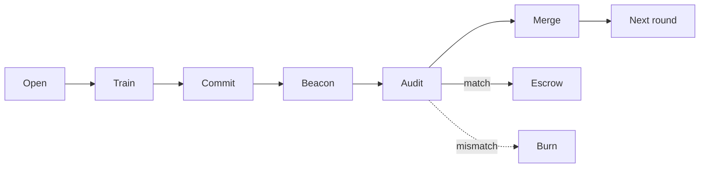
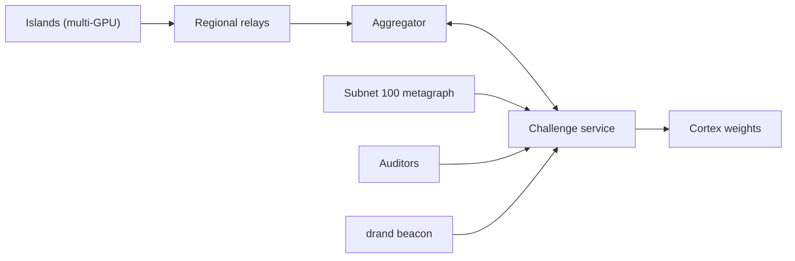
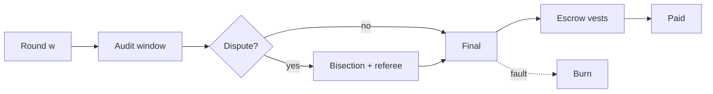

<h1 align="center">Hypertrain</h1>

<p align="center">
  
</p>

<p align="center">
  <b>Verifiable, permissionless pretraining for Bittensor subnet 100.</b><br>
  GPU clusters anywhere in the world train one model together. Every update can be replayed bit for bit, and rewards are released only after verification.
</p>

<p align="center">
  <a href="LICENSE"></a>
  <a href="https://github.com/CortexLM/hypertrain/actions/workflows/ci.yml"></a>
  
  
  
  
</p>

<p align="center">
  <a href="docs/index.md">Documentation</a> ·
  <a href="https://cortex.foundation">Website</a> ·
  <a href="https://github.com/CortexLM/cortex">Cortex</a> ·
  <a href="docs/miner.md">Miner guide</a> ·
  <a href="docs/operator.md">Operator guide</a> ·
  <a href="docs/network-v2.md">Network v2</a> ·
  <a href="docs/protocol.md">Protocol</a> ·
  <a href="docs/mechanism.md">Mechanism</a> ·
  <a href="docs/challenge-routes.md">API routes</a>
</p>

---

## Overview

Hypertrain is a [Cortex](https://github.com/CortexLM/cortex) challenge that pretrains language models from scratch on public datasets, using GPU clusters spread across datacenters worldwide. It targets the quality of a single large centralized cluster while letting anyone with registered hardware contribute.

| | |
| --- | --- |
| **Permissionless** | Any hotkey registered on subnet 100 can join. Admission, the hardware screen and probation run automatically, with no operator in the loop. |
| **Multi-GPU** | A miner is an *island*: one host or one datacenter cluster running data, expert and ZeRO-1 parallelism across all its GPUs. |
| **Verifiable** | Training is fully deterministic. Auditors replay sampled work and compare bytes, so faked work is detected, not estimated. |
| **Incentive-aligned** | Rewards vest in escrow over several rounds. Proven faults burn the round reward and everything still unvested. |
| **WAN-friendly** | DiLoCo-style rounds: islands train locally and exchange one compressed update per round through regional relays. |

## How it works

### Training round



1. **Open.** The round publishes the start model and a data assignment derived from public randomness.
2. **Train.** Each island runs H inner steps on its assigned samples, across all of its GPUs.
3. **Commit.** The island commits a Merkle root over checkpoint hashes taken every J steps, then uploads its compressed update.
4. **Beacon.** A drand quicknet round that exists only after the commit deadline selects who is audited and which segments are replayed.
5. **Audit.** Auditors replay those segments from public inputs and compare them byte for byte.
6. **Merge.** The aggregator applies a clipped outer step, and the next round starts from the merged model.

### Network topology



The challenge service holds runs, rounds and the integer ledger, and checks every miner signature against the live subnet 100 metagraph. Regional relays (Helm and Kustomize manifests in `deploy/`) carry updates between continents. Cortex reads final weights each epoch through `get_weights`.

### Reward lifecycle



A round becomes final once its audits and disputes close, and its reward then vests over about ten rounds. A miner who disagrees with a verdict disputes it: bisection narrows the disagreement from step to layer to single operation, and an independent referee settles it. Miners take part in disputes automatically with `hypertrain-miner watch --follow`.

## Security model

- **Bitwise replay.** Every source of randomness is pinned and all reductions are fixed-order, so qualified machines produce identical bytes. Verification has no tolerance thresholds.
- **Commit first, sample later.** The audit sample is drawn from a beacon round that does not exist when miners commit. The final window of every audited run is always checked.
- **Assigned data.** Samples come from a keyed permutation over a dataset with a published Merkle root. Training on other data fails replay.
- **Subnet-gated identity.** Join, proof, uploads, leaves, disputes and rewards all require a hotkey currently registered on subnet 100. A deregistered hotkey stops earning at the next epoch.
- **Compute self-check.** On admission, each GPU runs a fixed-seed workload and a VRAM probe. Hashes must match across the host and against the reference, which defeats NVML or driver identity spoofing.
- **Honeypots.** The operator runs committed honest and adversarial miners, so auditor catch rates and false positives are measured publicly after each reveal.
- **Robust aggregation.** Updates are norm-clipped. A fault caught later is removed with a bitwise one-round rollback.
- **Signed everything.** Every message is an sr25519 envelope with persistent replay protection, and the only clock is the latest verified drand round.

## Results

### Cross-host GPU determinism

| Experiment | Setup | Outcome |
| --- | --- | --- |
| Phase A | 59M-parameter dense model, BF16, 200 steps, 3 RTX 5090 hosts on 3 driver versions | 6 honest runs bitwise identical; the negative control diverges exactly at the predicted leaf |
| Phase B | 655M-parameter MoE, EP8 + ZeRO-1, two 8x RTX 5090 hosts (Quebec and Taiwan) | Leaves root, update hash, final model and top-k sets identical on both hosts |
| Network v2 | Four rounds, eight rank workers, two 2x RTX 5090 hosts | Same-driver bitwise qualification passed end to end |

Raw evidence and methodology: [docs/RESULTS.md](docs/RESULTS.md).

### Design experiments

- **Optimizer state across rounds:** `state_policy = carry` with segment audits. It beat reset, re-warmup and derived-state alternatives on a CPU proxy ([mechanism](docs/mechanism.md#8-evidence-from-experiments)).
- **Quality parity:** a pre-registered TOST protocol for many replicas across regions is specified in [docs/parity.md](docs/parity.md). Large-scale parity runs are on the roadmap.

## Quickstart

Requirements: Linux x86_64, Python 3.12, [uv](https://docs.astral.sh/uv/).

```bash
uv sync --frozen --extra trainer
uv run --frozen hypertrain-miner --help
uv run --frozen pytest -q tests/protocol tests/ledger
```

`bash scripts/check.sh` runs the full gate: format, lint, types and the complete test suite.

### Mine

```bash
# 1. Check your GPUs (deterministic workload + VRAM probe on every device)
uv run --frozen python -m hypertrain.miner.admission selfcheck

# 2. Join with a hotkey registered on subnet 100 (automatic admission)
uv run --frozen hypertrain-miner join-v2 --config miner.toml \
  --coldkey ~/.bittensor/coldkey.json --request-id "$(uuidgen)" --expiry <beacon-round>

# 3. Train round W on all GPUs of the island and answer disputes automatically
uv run --frozen hypertrain-miner run-v2 --config miner.toml --round W --watch

# Or follow disputes on their own, continuously
uv run --frozen hypertrain-miner watch --config miner.toml --follow
```

`run-v2` starts one rank per GPU through `torchrun`, using the layout (`n_gpus`, DP, EP, ZeRO-1) from the signed run manifest. See the [miner guide](docs/miner.md) and the [Network v2 guide](docs/network-v2.md).

### Run the challenge service

```bash
S=$(mktemp -d); mkdir -p "$S/state"
for f in internal admin worker; do openssl rand -hex 32 > "$S/$f.token"; done
openssl rand -hex 32 > "$S/coord.key"; chmod 600 "$S"/*

export CHALLENGE_STATE_DIR="$S/state" \
  CHALLENGE_NETUID=100 \
  CHALLENGE_MASTER_URL=http://cortex-master:8080 \
  CHALLENGE_INTERNAL_TOKEN_FILE="$S/internal.token" \
  CHALLENGE_ADMIN_TOKEN_FILE="$S/admin.token" \
  CHALLENGE_WORKER_TOKEN_FILE="$S/worker.token" \
  HYPERTRAIN_COORD_KEY_FILE="$S/coord.key"

uv run --frozen uvicorn hypertrain.challenge.app:app --host 127.0.0.1 --port 8000
```

One state directory hosts any number of concurrent runs, each with its own ledger, rounds and replay set. The [operator guide](docs/operator.md) covers run creation, auditors, honeypots and production deployment on a Cortex master.

### Container images

```bash
podman build -f docker/Dockerfile.server -t hypertrain:local .   # challenge service
podman build -f docker/Dockerfile.gpu -t hypertrain-gpu:local .  # miner and auditor, CUDA torch
HOST_PORT=18011 bash scripts/canary.sh                           # Cortex supervisor checks
```

CI publishes and attests both images to GHCR after each green build on `main`. The server image runs as UID 65532 with a read-only root filesystem.

### End-to-end test on Vast.ai

```bash
uv run --frozen python scripts/vast_e2e.py --key-file ~/.vast-key --max-usd 6 --max-minutes 90
```

The script rents a single 2x RTX 5090 host with the pinned GPU image and syncs the current source. It runs the GPU self-check, the CUDA test selectors and a full Network v2 round trip (service, multi-GPU miner, auditor replay). It then rescues the results and always deletes the instance. Add `--dry-run` to see the selected offer and its worst-case cost.

## Components

| Component | Run by | Role |
| --- | --- | --- |
| Challenge service (`hypertrain.challenge`) | Cortex master | Runs, rounds, subnet-gated admission, ledger, `get_weights` |
| Miner client (`hypertrain-miner`) | Miners | Join, multi-GPU training, commit, upload, state serving, automatic disputes |
| Trainer (`hypertrain.trainer`) | Miners, auditors | Deterministic dense/MoE decoder with DP/EP/ZeRO-1 island layout |
| Aggregator (`hypertrain.aggregator`) | Operator | Clipped outer step, relays, signed tapes, rollback, checkpoints |
| Auditor (`hypertrain.auditor`) | Operator auditors | Bitwise replay, step/layer/op bisection, referee, honeypots |
| Ledger (`hypertrain.ledger`) | Challenge service | Integer escrow, vesting, burn, clawback, hash-chained journal |
| Relays (`hypertrain.relay`, `deploy/`) | Regional operators | Transport and caching of updates between regions |

## Repository layout

```
src/hypertrain/
  protocol/   canonical JSON, sr25519 envelopes, Merkle trees, wire messages
  ledger/     escrow, vesting, burn, clawback, journal, get_weights
  data/       tokenizers, shards, dataset Merkle roots, sample assignment
  beacon/     drand quicknet client with BLS verification
  trainer/    deterministic decoder, inner optimizers, island layout, compression
  challenge/  FastAPI service: Cortex contract, admission, rounds, disputes
  aggregator/ outer step, robust screens, rollback, checkpoint verification
  auditor/    replay, bisection, referee, honeypots
  miner/      hypertrain-miner client, island launcher, self-check, dispute follower
  relay/      regional relay service
docs/         guides, specifications, routes, JSON schemas
deploy/       Kubernetes manifests and Cortex registry rows
docker/       server and GPU images
scripts/      quality gate, canary, publishing, Vast end-to-end harness
tests/        one directory per package
```

## Roadmap

- Large-scale quality parity runs against a centralized baseline, following the pre-registered protocol in [docs/parity.md](docs/parity.md).
- Cross-driver GPU qualification for Network v2 beyond the qualified driver set.
- Production-scale capacity profiles for rosters above the current service limit.

## Contributing

- `uv sync --frozen --all-extras`, then `bash scripts/check.sh` before opening a pull request.
- Verification stays bitwise. Tolerance checks, obfuscation or trusted-hardware assumptions are out of scope for the security model.
- When a route or message changes, update [docs/challenge-routes.md](docs/challenge-routes.md) and regenerate schemas with `uv run --frozen python -m hypertrain.protocol.schema docs/schemas`.
- Publishing goes through `scripts/publish.sh`, which runs a strict secret scan and requires an out-of-band approval token.

## License

Apache-2.0. See [LICENSE](LICENSE), [NOTICE](NOTICE) and [CHANGELOG](CHANGELOG.md).

- Hotkey decoding and signature checks follow [OpentypeAI/challenge](https://github.com/OpentypeAI/challenge) (Apache-2.0).
- Training data: [FineWeb-Edu](https://huggingface.co/datasets/HuggingFaceFW/fineweb-edu) (ODC-By 1.0, subject to Common Crawl terms).
- Public randomness: [drand](https://drand.love) quicknet.
