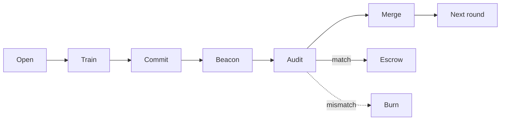
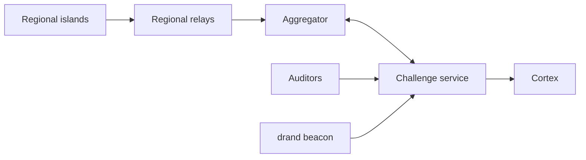
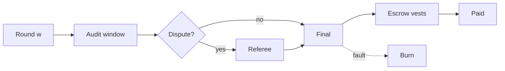

<h1 align="center">Hypertrain</h1>

<p align="center">
  
</p>

<p align="center">
  <b>Verifiable decentralized pretraining for the Cortex subnet.</b> GPU clusters anywhere in the world train one model together. Every update can be replayed bit for bit, and pay only arrives after the checks are done.
</p>

<p align="center">
  <a href="LICENSE"></a>
  
  
  
  
  <a href="https://github.com/CortexLM/cortex"></a>
</p>

<p align="center">
  <a href="docs/index.md">Documentation</a> ·
  <a href="https://cortex.foundation">Website</a> ·
  <a href="https://github.com/CortexLM/cortex">Cortex</a> ·
  <a href="docs/challenge-routes.md">Challenge routes</a> ·
  <a href="docs/miner.md">Miner guide</a> ·
  <a href="docs/operator.md">Operator guide</a> ·
  <a href="docs/protocol.md">Protocol</a> ·
  <a href="docs/mechanism.md">Mechanism</a> ·
  <a href="docs/parity.md">Parity</a> ·
  <a href="docs/schemas/">Message schemas</a> ·
  <a href="LICENSE">License</a>
</p>

> [!WARNING]
> **Research project, not stable.** Hypertrain is under active research and the code is not stable yet: interfaces, protocol messages and results can change without notice. For now it is used only for research, to refine the code and build the best possible decentralized training. Do not use it in production or to manage real funds.

---

## What is Hypertrain

Hypertrain is a challenge for [Cortex](https://github.com/CortexLM/cortex). Its goal is to pretrain large language models from scratch on public datasets, using many GPU clusters spread across datacenters around the world, and to get model quality close to what one big centralized cluster would give.

Three ideas hold it together:

1. **Train like DiLoCo.** Each cluster (an "island") trains its own copy of the model for a while, then sends a compressed update. An operator-run aggregator merges the updates into the next global model. Clusters only talk once per round, so slow links between continents are fine.
2. **Verify the work, don't trust it.** Training is fully deterministic. An auditor can take the same public inputs, rerun a sampled piece of a miner's work and get the exact same bytes. Any difference means the work was faked.
3. **Pay later.** Rewards sit in escrow and vest over several rounds. A miner caught cheating loses the round and everything still unvested. Lost money is burned, never handed to someone else.

Hypertrain is research software. The protocol, ledger, challenge service, trainer, auditor, aggregator and miner client are built and tested on CPU, and GPU determinism has been measured on real RTX 5090 hosts (see [Results so far](#results-so-far)). Quality parity with centralized training is **not** claimed yet.

## How it works

### 1. One training round



The round opens with a public start model and a data assignment. Miners train H inner steps on their assigned samples, then commit a Merkle root of their checkpoint hashes and upload compressed updates. The public drand beacon is published only after the commit deadline. It picks who gets audited and which pieces to replay, and auditors replay them and compare bytes. A match sends the reward to escrow, where it vests over the following rounds. A mismatch burns the round reward and the unvested escrow. The aggregator merges the uploaded updates with robust clipping, and the next round starts from the merged model.

Every miner starts from the same public model and gets a slice of the dataset picked by public randomness. Before anyone knows who will be checked, each miner locks in a fingerprint of its whole run. Only then does the beacon decide which miners and which pieces get replayed, so a cheater can't guess which parts are safe to fake.

### 2. Network layout



Regions hold several islands each, and the diagram collapses them into one node. An island is one machine or a cluster of GPUs in one datacenter, and it trains on its own. Updates from nearby islands are combined by a regional relay first, so the long-distance links only carry a few merged updates. The challenge service keeps the round state and the ledger, auditors replay work, and Cortex reads the final weights from it each epoch.

### 3. When rewards are paid



Round w is trained, committed and uploaded, then enters the audit window. If a dispute opens, bisection finds the first differing step and a referee decides. The reward vests over about 10 rounds and is paid through get_weights. A fault found at any point burns the round reward and the unvested escrow.

Nothing is paid the moment work is submitted. A round is final only after its audits and any disputes close, and even then the reward vests slowly. If a miner thinks an auditor got it wrong, the dispute narrows the disagreement down to one step and an independent referee settles it; a miner who wins gets the held-back pay back.

## Why it can't be faked

- **Bitwise replay, no tolerances.** The trainer pins every source of randomness and uses fixed-order math, so the same inputs give the same bytes on any qualified machine. Auditors don't ask "is this close enough?". They ask "is this identical?".
- **Commit first, sample later.** Miners commit a Merkle root over checkpoint hashes taken every J steps. The audit sample comes from a drand beacon round that only exists after the commit deadline. In the full replay mode a faked step anywhere changes a committed leaf, and in segment mode the final window is always checked, so "only fake the last step" doesn't work either.
- **Assigned data.** Which samples a miner trains on comes from the beacon plus a keyed permutation over a dataset with a published Merkle root. Training on other data shows up on replay.
- **Honeypots.** The operator runs its own miners, some honest and some cheating on purpose, and commits to their identities in advance. After the reveal anyone can see how often auditors caught the cheaters and whether they ever flagged an honest one.
- **Robust merging.** The aggregator clips each update, so even an unaudited bad update has a bounded effect. A bad update that is caught later is removed with a bitwise one-round rollback.
- **Money at risk.** Escrow, vesting and burning make cheating cost more than it can earn. No miner ever reports its own score.

## Results so far

### GPU determinism, Phase A: PASS

The open question behind the whole design was whether an RTX 5090 gives bit-identical BF16 training results on different machines. It does, for this trainer:

| Item | Result |
| --- | --- |
| Hosts | 3 different RTX 5090 machines (3 different hosts, drivers 580.105.08, 580.178.04 and 595.84) |
| Model | 59,010,560 parameters, BF16 compute, 200 inner steps, a leaf every 10 steps (21 leaves) |
| Honest runs | 6 runs, all with the same leaves, Merkle root, update hash and final model hash |
| Negative control | One input changed at step 101, first different leaf is 11, exactly as predicted |
| Cost | USD 0.63 settled (cap USD 10), zero instances left running |

Evidence was recomputed from the raw rescued artifacts by an independent verifier. The run used a pinned image (`vastai/pytorch` at digest `sha256:450710d8...d856`), `torch 2.14.0+cu130`, deterministic algorithms on and TF32 off.

### Results from the experiments

- **Optimizer state between rounds.** Decided: `state_policy = carry` with segment audits. On a 4.3M-parameter CPU proxy the reset arm A1, re-warmup arm A2 and derived arm A3 all failed the gate; A1 was 2.23%{ev:experiments/results/decision.json#cells.M2_H30.arms.A1.mean_gap*100} worse than carry at M=2, H=30 (A3: 10.5%{ev:experiments/results/decision.json#cells.M2_H30.arms.A3.mean_gap*100}). Tiny proxy, no claim about scale; see [docs/mechanism.md](docs/mechanism.md#8-evidence-from-experiments).

- **Parity thresholds.** The CPU grid for many replicas across regions did not finish: 0{ev:experiments/results/summary.json#full_scale_status.jobs_done} of 150{ev:experiments/results/summary.json#full_scale_status.jobs_censored} full-scale jobs completed before the user stopped it, so parity is not demonstrated and a 100B claim stays an extrapolation. Details and the re-run recipe are in [docs/parity.md](docs/parity.md#5-results-of-the-cpu-grid).

- **GPU determinism, Phase B: passed, with a cost flag.** On two hosts of 8x RTX 5090 (Quebec and Taiwan, drivers 580.95.05 and 580.159.03), one round of a 654965760{ev:experiments/results/phase_b_summary.json#runs.0.result.param_count}-parameter MoE (H=30{ev:experiments/results/phase_b_summary.json#runs.0.result.H}, J=5{ev:experiments/results/phase_b_summary.json#runs.0.result.J}) gave identical leaves root, delta hash, final theta and top-k sets on both hosts. Peak memory was 78%{ev:experiments/results/phase_b_summary.json#b2.per_host.h0.probe_peak_mem_frac*100} per GPU. Determinism costs too much: base/det time ratio 1.97{ev:experiments/results/phase_b_summary.json#overhead.per_host_ratio.h0} and 2.06{ev:experiments/results/phase_b_summary.json#overhead.per_host_ratio.h1}, above the plan's 1.6 re-plan flag. Part of that gap is the baseline using TF32, bf16 reduced-precision reductions and cuDNN autotune; the split is not measured. Inter-host TCP (cubic) reached 0.03{ev:experiments/results/phase_b_summary.json#network.iperf.iperf-h0-cubic-P1.received_Gbps}, 0.15{ev:experiments/results/phase_b_summary.json#network.iperf.iperf-h0-cubic-P8.received_Gbps} and 0.47{ev:experiments/results/phase_b_summary.json#network.iperf.iperf-h0-cubic-P32.received_Gbps} Gbit/s with 1, 8 and 32 streams; BBR could not be tested because the host kernel lacks it. Phase B cost USD 11.57{ev:experiments/results/phase_b_summary.json#cost.total_usd}. Details: [docs/mechanism.md](docs/mechanism.md#cross-host-bitwise-result).

## Quickstart

You need Linux x86_64, Python 3.12 and [uv](https://docs.astral.sh/uv/).

```bash
# Install, including the CPU build of torch for the trainer
uv sync --frozen --extra trainer

# Command line tools
uv run --frozen hypertrain-miner --help          # miner client: join, run
uv run --frozen hypertrain --help                # verify-checkpoint
uv run --frozen python -m hypertrain.auditor --help

# A quick part of the test suite (protocol and ledger, 139 tests)
uv run --frozen pytest -q tests/protocol tests/ledger
```

The full quality gate (format, lint, types and every test) is `bash scripts/check.sh`. CI runs it on each push. It takes a while.

### Run the challenge service locally

```bash
S=$(mktemp -d); mkdir -p "$S/state"
for f in internal admin worker; do openssl rand -hex 32 > "$S/$f.token"; done
openssl rand -hex 32 > "$S/coord.key"; chmod 600 "$S"/*

export CHALLENGE_STATE_DIR="$S/state" \
  CHALLENGE_INTERNAL_TOKEN_FILE="$S/internal.token" \
  CHALLENGE_ADMIN_TOKEN_FILE="$S/admin.token" \
  CHALLENGE_WORKER_TOKEN_FILE="$S/worker.token" \
  HYPERTRAIN_COORD_KEY_FILE="$S/coord.key"

uv run --frozen uvicorn hypertrain.challenge.app:app --host 127.0.0.1 --port 8000
```

In another shell:

```bash
curl -s http://127.0.0.1:8000/version
# {"slug":"hypertrain","version":"0.1.0","contract":1,"capabilities":["get_weights","proxy_routes"]}
curl -s http://127.0.0.1:8000/v1/runs
# {"runs":[]}
```

`/health` returns 200 once the secrets are readable. Creating a run needs a RunManifest signed by the owner hotkey; the [operator guide](docs/operator.md) walks through it, and the [miner guide](docs/miner.md) covers joining a run.

### Container images

```bash
podman build -f docker/Dockerfile.server -t hypertrain:local .   # challenge service, port 8000
podman build -f docker/Dockerfile.gpu -t hypertrain-gpu:local .  # miner and auditor, CUDA torch
HOST_PORT=18011 bash scripts/canary.sh                           # Cortex supervisor checks
```

The server image runs as UID 65532 with a read-only root filesystem and writes only to `/data`. `scripts/canary.sh` checks that, plus the Cortex labels and the `/version`, `/health` and `get_weights` behavior with and without secrets.

## Repository layout

```
src/hypertrain/
  protocol/     canonical JSON (RFC 8785), sr25519 envelopes, tensor hashes, Merkle trees, wire messages
  ledger/       integer reward ledger: escrow, vesting, burn, clawback, hash-chained journal, get_weights
  data/         pinned tokenizers, u32 shards, dataset Merkle root, PRP sample assignment, object stores
  beacon/       drand quicknet client with BLS verification, plus a fixture beacon for tests
  trainer/      deterministic dense/MoE decoder, inner AdamW/Muon, leaves, delta compression, island layout
  challenge/    FastAPI container: Cortex contract v1, run lifecycle, rounds, intake, audit queue
  aggregator/   outer step, robust screens, regional relays, rollback, checkpoints, verify-checkpoint CLI
  auditor/      bitwise replay, dispute bisection, honeypots, auditor worker
  miner/        hypertrain-miner client: join, accept, train, commit, upload, serve state
  gpu_ops/      paid GPU test tooling: budget gate, journaled launcher, deadline supervisor
docs/           challenge routes, JSON schemas, guides
docker/         server and GPU images
deploy/         Cortex registry and trust-root rows
experiments/    data fetch, GPU Phase A/B drivers, DiLoCo simulator
scripts/        quality gate, canary, image and evidence checks
tests/          one directory per package
```

## Components

| Component | Who runs it | What it does |
| --- | --- | --- |
| Challenge service (`hypertrain.challenge`) | Cortex master | Holds runs, rounds and the ledger; answers `get_weights`; signs receipts with the coordinator key |
| Miner client (`hypertrain-miner`) | Miners | Accepts a round, trains on the assigned samples, commits, uploads the update, serves state for audits, disputes verdicts |
| Trainer (`hypertrain.trainer`) | Miners and auditors | Deterministic inner loop with a committed leaf every J steps and canonical update compression |
| Aggregator (`hypertrain.aggregator`) | Operator | Clipped outer step, regional relays, signed event tapes, one-round rollback, final checkpoints |
| Auditor (`python -m hypertrain.auditor`) | Operator auditors | Leases audit jobs, replays them, posts signed verdicts; bisection and referee for disputes |
| Honeypots (`hypertrain.auditor.honeypot`) | Operator | Committed honest and cheating miners that measure the auditors' catch and false-positive rates |
| Ledger (`hypertrain.ledger`) | Inside the challenge service | Integer escrow, vesting, burns and clawback; rebuilt byte for byte from its journal |
| Checkpoint check (`hypertrain verify-checkpoint`) | Anyone | Verifies a final checkpoint's file hashes, signed manifest and lineage |

Every route, body and status code is listed in [docs/challenge-routes.md](docs/challenge-routes.md). JSON schemas for every signed message are in [docs/schemas/](docs/schemas/).

## Security model and limitations

What is enforced:

- Every message from a miner, auditor, coordinator or owner is a signed envelope with replay protection, and the replay set survives restarts.
- The only clock is the latest verified drand round, so deadlines can't be gamed with local time.
- Verdicts are bitwise. There are no tolerance thresholds anywhere in verification.
- Keyfiles with loose permissions are refused; secrets are read from files and never logged.

What isn't done yet, honestly:

- **Single GPU miner client.** `hypertrain-miner` currently enforces one GPU per island. The multi-rank island layout exists in `trainer/island.py` and is tested on CPU, but the client doesn't launch it yet.
- **Joining is manual.** Contract v1 has no public join route. `hypertrain-miner join` prints a signed admission request (with a hardware self-check) that the operator adds to the roster.
- **Dispute bisection in the miner is step level only.** The auditor side bisects down to layer and operation; the miner client takes part at step level and doesn't poll open disputes on its own.
- **GPU determinism is proven for one setup.** Phase A covers single RTX 5090 hosts with a pinned image. Multi-GPU hosts (Phase B) passed on two hosts; see the Phase B note above. The hardware self-check has only run on CPU.
- **Quality parity is unproven.** No parity claim is made until the pending CPU and GPU work reports.
- **One run per state directory** in the challenge service.
- **The publish secret scan is a heuristic.** `scripts/publish.sh` skips digit-free values of 20+ characters under a credential parent. It does not guarantee a clean tree, so the out-of-band token approval and a manual review stay mandatory.

## Contributing

- Install with `uv sync --frozen --all-extras` and run `bash scripts/check.sh` before opening a pull request.
- Verification must stay bitwise. Pull requests that add tolerance checks, obfuscation or trusted hardware as a security layer won't be accepted.
- When a route or message changes, update [docs/challenge-routes.md](docs/challenge-routes.md) and regenerate the schemas with `uv run --frozen python -m hypertrain.protocol.schema docs/schemas`.
- Add tests at the boundary you changed, next to the existing ones in `tests/`.

## License

Apache-2.0, see [LICENSE](LICENSE), [NOTICE](NOTICE) and [CHANGELOG](CHANGELOG.md).

Attribution:

- Hotkey decoding and signature checks follow [OpentypeAI/challenge](https://github.com/OpentypeAI/challenge) (Apache-2.0), and the auditor lease routes follow its job-lease pattern.
- Training data: [FineWeb-Edu](https://huggingface.co/datasets/HuggingFaceFW/fineweb-edu) by Hugging Face, licensed under ODC-By 1.0 and subject to Common Crawl terms of use.
- Public randomness: [drand](https://drand.love) quicknet.
